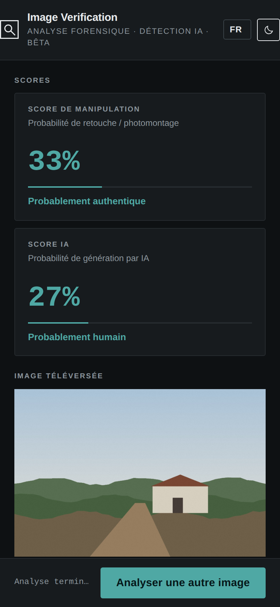
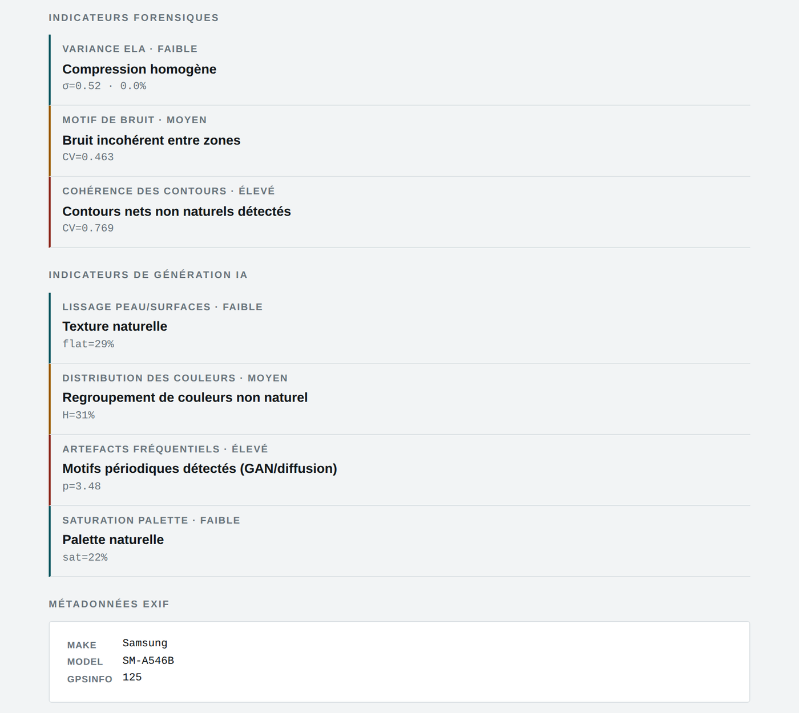
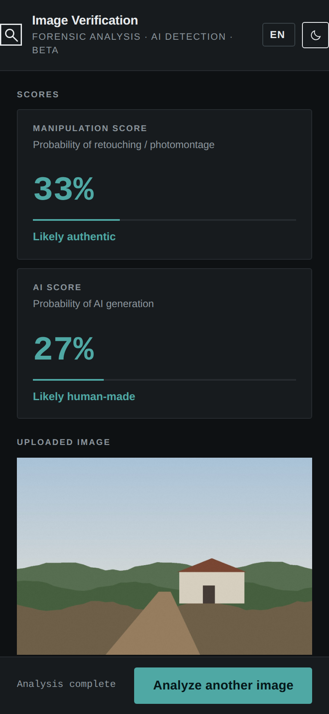
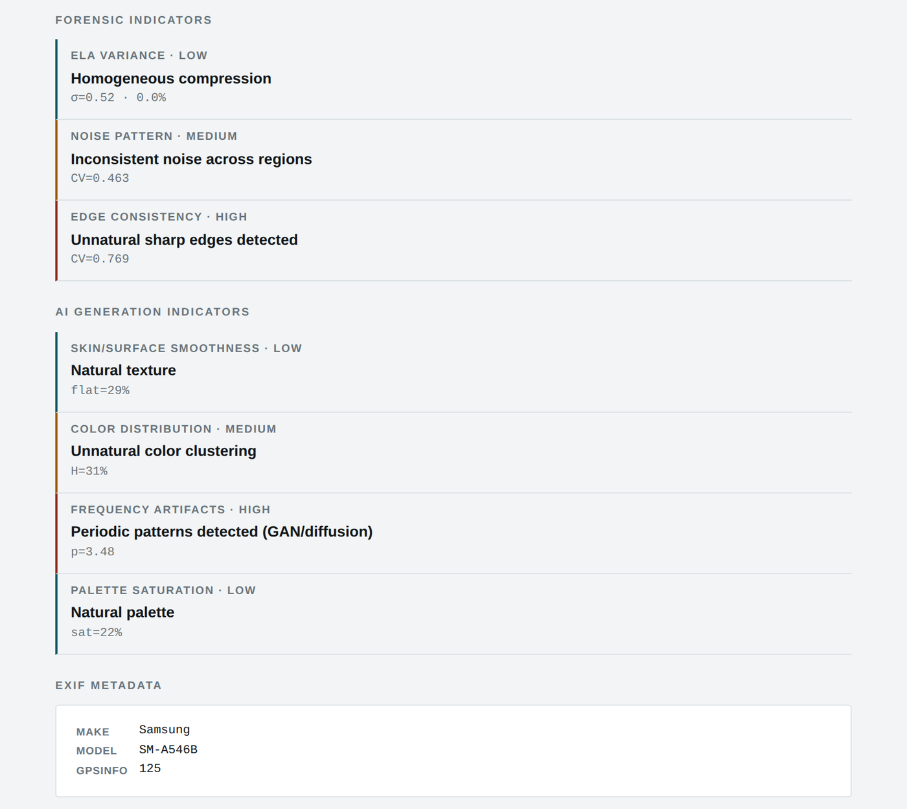

# Image Verification

**`IMAGE_VERIFICATION.html`** · Hors ligne · Aucune installation · Aucun envoi — *Offline · No install · No upload*

**[Français](#français) · [English](#english)**

---

## Français

### À quoi sert cet outil

Cet outil aide à repérer des signes de retouche (photomontage) ou de génération par intelligence artificielle dans une image. Il combine plusieurs analyses heuristiques (niveau d'erreur ELA, bruit, contours, couleurs, motifs) et fournit deux scores ainsi que le détail des indicateurs. Il s'agit d'une aide à l'analyse en version bêta : ses résultats ne constituent pas une preuve.

### Avant de commencer

- Ouvrez le fichier IMAGE_VERIFICATION.html par double-clic : il s'affiche dans votre navigateur (Chrome, Edge, Firefox ou Safari récents). Aucune installation n'est nécessaire.
- L'outil fonctionne sans connexion Internet. Aucun fichier n'est envoyé : tout le traitement se fait sur votre appareil.
- La langue (FR, EN, SW, LN) se choisit en haut à droite ; le bouton voisin bascule entre thème clair et sombre. Ces choix sont mémorisés.

### L'écran en un coup d'œil

1. Score de manipulation : probabilité de retouche
2. Score IA : probabilité de génération par IA
3. Image analysée (nom, taille, dimensions)
4. Carte ELA : différences de recompression
5. « Analyser une autre image »

#### Sur téléphone (thème sombre)

### Utilisation pas à pas

1. Cliquez sur « Choisir ou déposer une image » (JPEG, PNG ou WEBP, 20 Mo au maximum). L'analyse démarre aussitôt.
2. Lisez les deux scores et leur verdict (voir tableau ci-dessous).
3. Examinez la carte ELA. Des zones sombres et homogènes indiquent une compression uniforme ; des zones claires (jaunes ou rouges) localisées signalent une recompression différente, possible signe de retouche, à confirmer visuellement.
4. Consultez les indicateurs (faible, moyen, élevé) et les métadonnées EXIF. Un logiciel de retouche détecté dans les métadonnées est signalé.
5. Cliquez sur « Analyser une autre image » pour recommencer.

#### Lecture des scores

| Score | Verdict |
|---|---|
| **0 à 34 %** | Probablement authentique / probablement humain |
| **35 à 59 %** | Doute : analyse manuelle recommandée |
| **60 à 100 %** | Forte suspicion de retouche / probablement généré par IA |

### Résultat

*Détail des indicateurs forensiques, des indicateurs IA et des métadonnées EXIF.*

### Bonnes pratiques

- Les scores sont des indices. Une photo authentique très compressée, recadrée ou publiée sur un réseau social peut obtenir un score élevé ; une retouche habile peut obtenir un score faible.
- Analysez toujours le fichier le plus proche de l'original. L'absence d'EXIF ne prouve pas une manipulation.
- Pour toute pièce destinée à une procédure, faites intervenir un expert en analyse forensique. Conservez l'original et son empreinte (Forensic Hash Calculator).

### En cas de problème

| Problème | Solution |
|---|---|
| **Format refusé** | Seuls JPEG, PNG et WEBP sont acceptés. Convertissez l'image (les photos HEIC d'iPhone notamment). |
| **« Image trop volumineuse »** | La limite est de 20 Mo. Utilisez une version de taille inférieure en gardant à l'esprit que la réduction modifie l'analyse. |
| **Carte ELA presque entièrement noire** | L'image est très uniforme ou fortement compressée : l'ELA est alors peu informative. Fiez-vous aux autres indicateurs. |

### Confidentialité

L'outil fonctionne entièrement sur votre appareil, sans connexion Internet. Aucune donnée n'est transmise ni conservée en dehors des fichiers que vous téléchargez vous-même.

---

## English

### What this tool is for

This tool helps spot signs of retouching (photomontage) or AI generation in an image. It combines several heuristic analyses (Error Level Analysis, noise, edges, colours, patterns) and gives two scores plus detailed indicators. It is a beta analysis aid: its results are not proof.

### Before you start

- Double-click IMAGE_VERIFICATION.html: it opens in your browser (recent Chrome, Edge, Firefox or Safari). Nothing to install.
- The tool works without an Internet connection. No file is uploaded: everything is processed on your device.
- Choose the language (FR, EN, SW, LN) at the top right; the button next to it switches between light and dark theme. Both choices are remembered.

### The screen at a glance

1. Manipulation score: probability of retouching
2. AI score: probability of AI generation
3. Analysed image (name, size, dimensions)
4. ELA map: recompression differences
5. “Analyze another image”

#### On a phone (dark theme)

### Step by step

1. Click “Choose or drop an image” (JPEG, PNG or WEBP, 20 MB max). Analysis starts immediately.
2. Read both scores and their verdict (see the table below).
3. Look at the ELA map. Dark, even areas mean uniform compression; localised bright (yellow or red) areas show different recompression, a possible sign of editing to be confirmed visually.
4. Review the indicators (low, medium, high) and the EXIF metadata. Editing software found in the metadata is flagged.
5. Click “Analyze another image” to start again.

#### Reading the scores

| Score | Verdict |
|---|---|
| **0 to 34 %** | Likely authentic / likely human-made |
| **35 to 59 %** | Doubt: manual review recommended |
| **60 to 100 %** | Strong suspicion of retouching / likely AI-generated |

### Result

*Forensic indicators, AI indicators and EXIF metadata in detail.*

### Good practice

- Scores are clues. A genuine photo that is heavily compressed, cropped or posted on social media can score high; skilful editing can score low.
- Always analyse the file closest to the original. Missing EXIF does not prove manipulation.
- For any exhibit meant for proceedings, involve a forensic image expert. Keep the original and its hash (Forensic Hash Calculator).

### Troubleshooting

| Problem | Solution |
|---|---|
| **Format refused** | Only JPEG, PNG and WEBP are accepted. Convert the image (iPhone HEIC photos in particular). |
| **“Image too large”** | The limit is 20 MB. Use a smaller version, bearing in mind that resizing affects the analysis. |
| **ELA map almost entirely black** | The image is very uniform or heavily compressed: ELA is not informative here. Rely on the other indicators. |

### Privacy

The tool runs entirely on your device, without an Internet connection. No data is sent or kept anywhere other than the files you download yourself.
