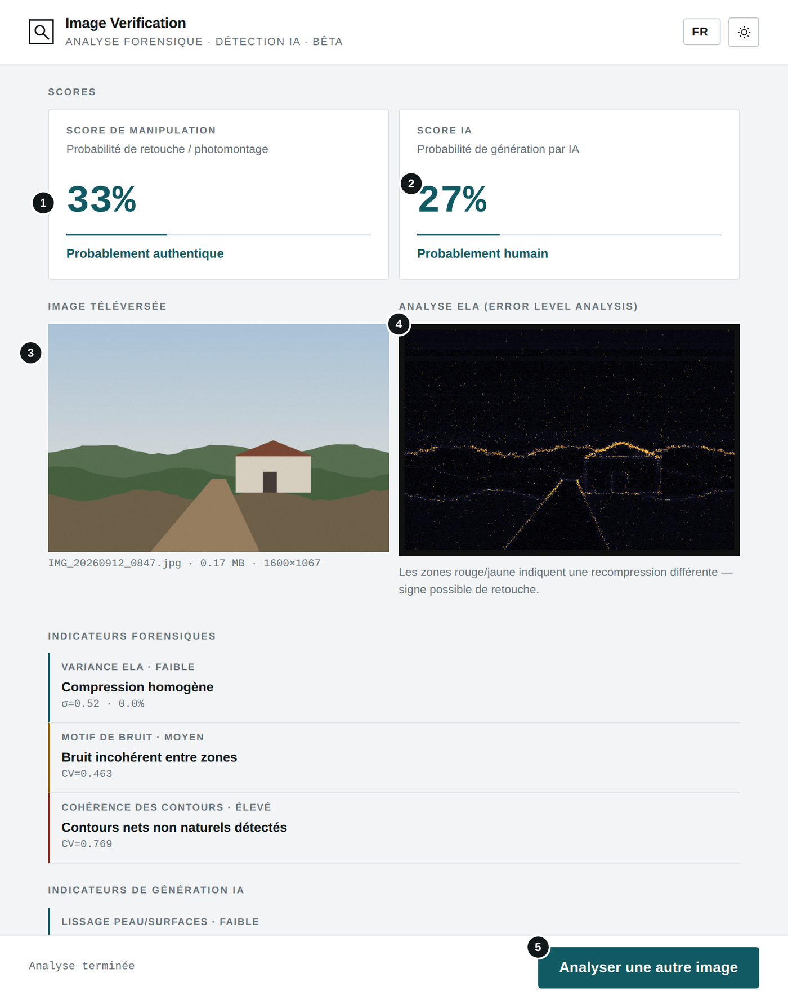
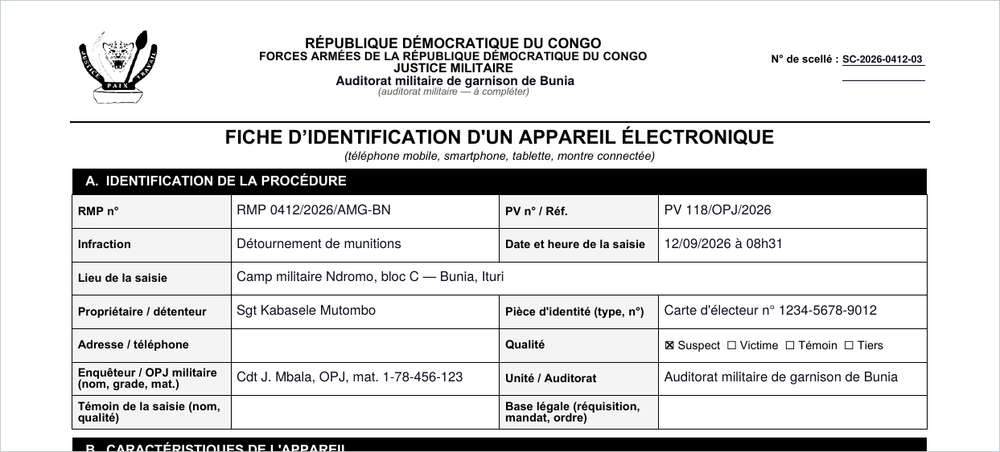
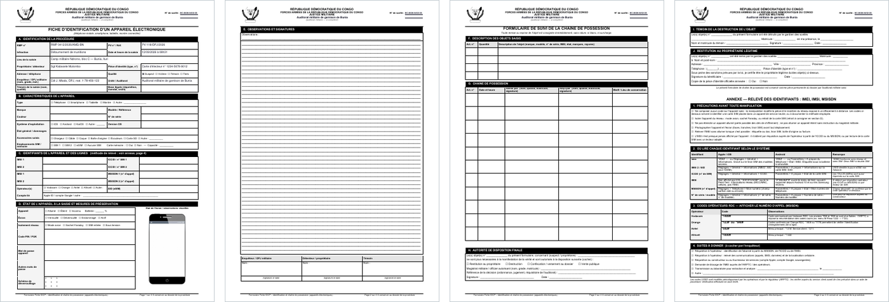
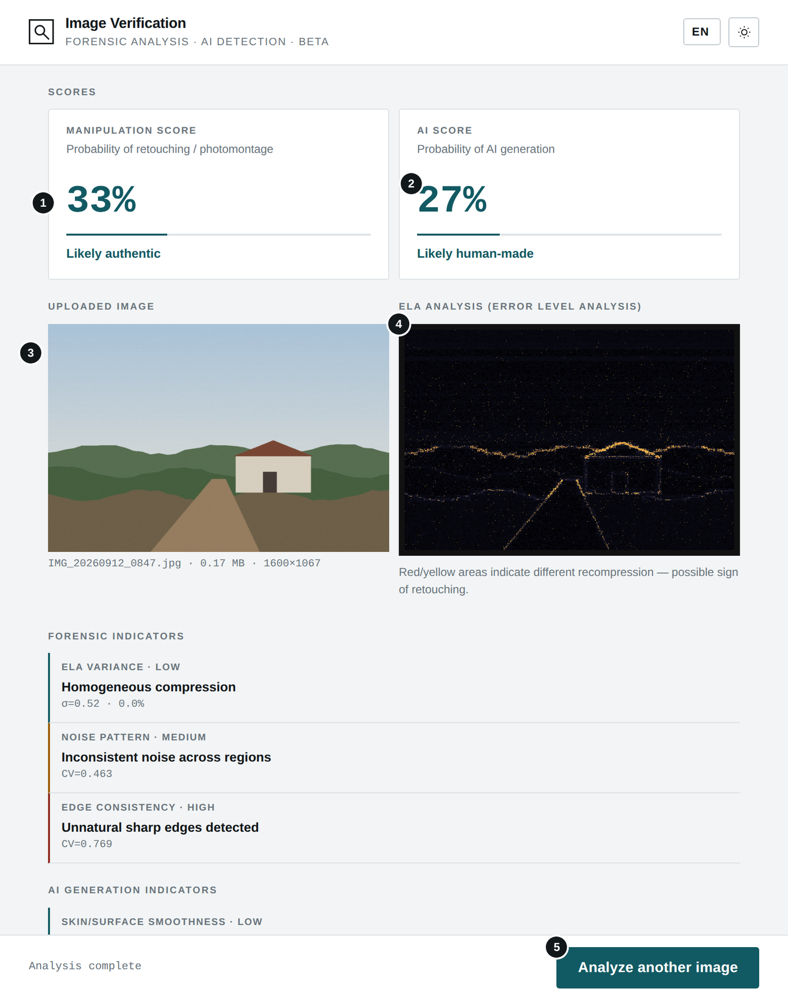

# Générateur Fiche IDCP · IDCP Form Generator

**`GENERATEUR_FICHE_IDCP.html`** · FICHE D’IDENTIFICATION D'UN APPAREIL ÉLECTRONIQUE (IDCP) · PDF + DOCX · Hors ligne — *Offline*

**[Français](#français) · [English](#english)**

---

## Français

### À quoi sert cet outil

Cet outil produit la fiche officielle « Fiche d'identification d'un appareil électronique (IDCP) » — identification et chaîne de possession — au format PDF et/ou Word (DOCX). Vous saisissez les informations de la procédure (section A) et de l'en-tête ; l'outil les reporte dans la fiche complète de 4 pages, identique au modèle. Tous les champs sont facultatifs : ceux laissés vides restent à compléter à la main.

### Avant de commencer

- Ouvrez le fichier GENERATEUR_FICHE_IDCP.html par double-clic : il s'affiche dans votre navigateur (Chrome, Edge, Firefox ou Safari récents). Aucune installation n'est nécessaire.
- L'outil fonctionne sans connexion Internet. Aucune donnée n'est envoyée ni enregistrée : ce que vous saisissez disparaît à la fermeture de la page.
- La langue de l'interface (FR, EN, SW, LN) se choisit en haut à droite, à côté du bouton de thème clair ou sombre. La fiche générée est toujours en français.

### L'écran en un coup d'œil

1. Langue de l'interface
2. Thème clair ou sombre
3. En-tête : n° de scellé et auditorat militaire, repris sur les 4 pages
4. « Tout effacer » : vide tous les champs
5. « Maintenant » : inscrit la date et l'heure actuelles
6. Qualité : un seul choix ; un second clic le retire
7. Aperçu : ouvre le PDF dans un nouvel onglet
8. Télécharger la fiche au format Word (DOCX)
9. Télécharger la fiche au format PDF

### Utilisation pas à pas

1. Renseignez, si vous les connaissez, le n° de scellé et l'auditorat militaire : ils figureront en haut de chacune des 4 pages.
2. Remplissez les champs utiles de la section A (RMP, PV, infraction, date et heure, lieu, propriétaire, pièce d'identité, adresse, enquêteur, unité, témoin, base légale). Le bouton « Maintenant » inscrit la date et l'heure du moment.
3. Choisissez la qualité de la personne : Suspect, Victime, Témoin ou Tiers. L'option retenue apparaît sur fond coloré avec une coche.
4. Cliquez sur « Aperçu » pour contrôler le PDF, puis sur « Télécharger le PDF » et/ou « DOCX ».
5. Imprimez la fiche et complétez à la main les sections B à J, puis faites signer les personnes concernées.

#### Contenu de la fiche générée (4 pages)

| Page | Sections |
|---|---|
| **Page 1** | A. Identification de la procédure · B. Caractéristiques de l'appareil · C. Identifiants · D. État et mesures de préservation |
| **Page 2** | E. Observations et signatures |
| **Page 3** | F. Objets saisis · G. Chaîne de possession · H. Autorité de disposition finale |
| **Page 4** | I. Témoin de la destruction · J. Restitution · Annexe IMEI / IMSI / MSISDN |

### Résultat

*Page 1 de la fiche générée, avec les champs remplis.*

*Les 4 pages de la fiche, identiques au modèle officiel.*

### Bonnes pratiques

- Un texte trop long passe à la ligne dans sa case ; dans le PDF, sa taille diminue si nécessaire pour qu'il y tienne. La saisie est limitée à 150 caractères par champ (220 pour le lieu).
- Le DOCX reste modifiable dans Word ; le PDF est prêt à imprimer. Générez les deux si la fiche doit être complétée sur ordinateur puis archivée.
- Les champs vides restent vierges sur la fiche : ne les remplissez pas avec des informations incertaines.
- Les sections B à J et l'annexe ne sont pas saisies dans l'outil : elles se complètent sur la fiche imprimée, sans rature ni surcharge.

### En cas de problème

| Problème | Solution |
|---|---|
| **« Aperçu » n'ouvre rien** | Le navigateur bloque les fenêtres : autorisez-les pour ce fichier, ou utilisez directement « Télécharger le PDF ». |
| **Un caractère apparaît comme « ? » dans le PDF** | Il n'est pas pris en charge par la police du PDF (écritures non latines). Il est conservé tel quel dans le DOCX. |
| **Le texte paraît petit dans une case** | Le texte est long : il a été réduit pour rester dans la case. Abrégez-le si besoin. |
| **Le n° de scellé est coupé sur deux lignes** | Il est trop long pour une ligne : c'est normal, la case en prévoit deux. |

### Confidentialité

L'outil fonctionne entièrement sur votre appareil, sans connexion Internet. Les informations saisies ne sont ni envoyées ni enregistrées ; elles figurent uniquement dans les fichiers que vous téléchargez.

---

## English

### What this tool is for

This tool produces the official form “Electronic device identification form (IDCP)” — identification and chain of custody — as PDF and/or Word (DOCX). You enter the case details (section A) and the header; the tool prints them on the complete 4-page form, identical to the template. All fields are optional: those left empty stay blank, to be completed by hand.

### Before you start

- Double-click GENERATEUR_FICHE_IDCP.html: it opens in your browser (recent Chrome, Edge, Firefox or Safari). Nothing to install.
- The tool works without an Internet connection. No data is sent or stored: what you type disappears when you close the page.
- Choose the interface language (FR, EN, SW, LN) at the top right, next to the light/dark theme button. The generated form is always in French.

### The screen at a glance

1. Interface language
2. Light or dark theme
3. Header: seal number and military prosecutor's office, repeated on all 4 pages
4. “Clear all”: empties every field
5. “Now”: enters the current date and time
6. Status: a single choice; click again to remove it
7. Preview: opens the PDF in a new tab
8. Download the form as Word (DOCX)
9. Download the form as PDF

### Step by step

1. If known, enter the seal number and the military prosecutor's office: they will appear at the top of all 4 pages.
2. Fill in the relevant section A fields (RMP, report no., offence, date and time, place, owner, ID document, address, investigator, unit, witness, legal basis). The “Now” button enters the current date and time.
3. Choose the person's status: Suspect, Victim, Witness or Third party. The selected option appears on a coloured background with a tick.
4. Click “Preview” to check the PDF, then “Download PDF” and/or “DOCX”.
5. Print the form, complete sections B to J by hand, and have the people concerned sign it.

#### Contents of the generated form (4 pages)

| Page | Sections |
|---|---|
| **Page 1** | A. Case identification · B. Device characteristics · C. Identifiers · D. Condition and preservation measures |
| **Page 2** | E. Observations and signatures |
| **Page 3** | F. Seized items · G. Chain of custody · H. Final disposition authority |
| **Page 4** | I. Destruction witness · J. Return to owner · IMEI / IMSI / MSISDN annex |

### Result

*Page 1 of the generated form, with the filled fields.*

*The 4 pages of the form, identical to the official template.*

### Good practice

- Long text wraps inside its box; in the PDF it is also made smaller if needed so it fits. Input is limited to 150 characters per field (220 for the place).
- The DOCX stays editable in Word; the PDF is ready to print. Generate both if the form will be completed on a computer and then archived.
- Empty fields stay blank on the form: do not fill them with uncertain information.
- Sections B to J and the annex are not entered in the tool: complete them on the printed form, without erasures or overwriting.

### Troubleshooting

| Problem | Solution |
|---|---|
| **“Preview” opens nothing** | The browser is blocking pop-ups: allow them for this file, or use “Download PDF” directly. |
| **A character shows as “?” in the PDF** | It is not supported by the PDF font (non-Latin scripts). It is kept as is in the DOCX. |
| **Text looks small in a box** | The text is long: it was reduced to stay inside the box. Shorten it if needed. |
| **The seal number is split over two lines** | It is too long for one line: this is expected, the box allows two. |

### Privacy

The tool runs entirely on your device, without an Internet connection. What you type is neither sent nor stored; it only appears in the files you download.

---

*Bibliothèques intégrées / Embedded libraries: pdf-lib 1.17.1 (MIT) · JSZip 3.10.1 (MIT).*
